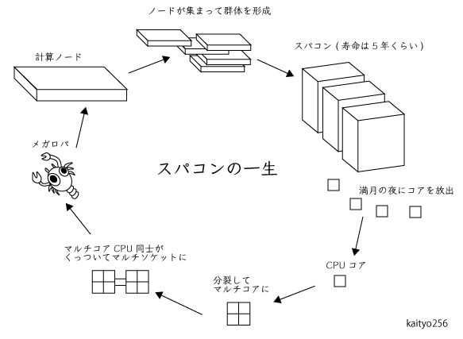

# スパコンの一生

## 概要

スパコンの一生について以前つぶやきました。

<blockquote class="twitter-tweet">
スパコンがどうやってできるか知らない人が多いみたいなんで図解してみました。 <a href="https://t.co/oIxKw3JF20">pic.twitter.com/oIxKw3JF20</a>
&mdash; ロボ太 (@kaityo256) <a href="https://twitter.com/kaityo256/status/882186595901689856?ref_src=twsrc%5Etfw">July 4, 2017</a></blockquote> 

画像はこれです。

この画像について、元のファイルが欲しい、という奇特な方がいらっしゃったので、元のイラストレータファイル(`s_life.ai`)を置いておきます。

ライセンスはCC-BYとするので好き放題してください。

## ライセンス

Copyright (C) 2017-2019 Hiroshi Watanabe

このリポジトリに含まれる`s_life.png`及び`s_life.ai`はクリエイティブ・コモンズ 4.0 表示 (CC-BY 4.0) で提供する。

The pictures in this repository are licensed under a Creative Commons Attribution 4.0 International License.
